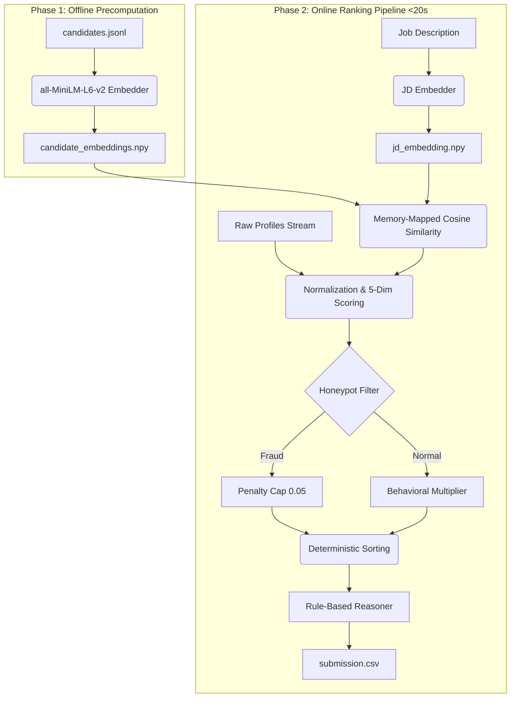

# 🎯 RedRob Intelligent Candidate Ranking System

[](https://www.python.org/)
[](https://huggingface.co/spaces/Yuvaakhil18/redrob-ranker)
[](https://numpy.org/)
[](https://huggingface.co/sentence-transformers/all-MiniLM-L6-v2)
[](https://huggingface.co/spaces/Yuvaakhil18/redrob-ranker)

> **India Runs Data and AI Challenge | Challenge 1 | Hack2Skill × Redrob**
> An enterprise-grade, offline-online hybrid semantic and rule-based candidate discovery and ranking system. Designed to search, normalize, score, and justify candidate recommendations from a pool of 100,000+ applicants under 20 seconds.

**Live Space Link:** [https://huggingface.co/spaces/Yuvaakhil18/redrob-ranker](https://huggingface.co/spaces/Yuvaakhil18/redrob-ranker)  
**GitHub Repository:** [https://github.com/Yuvaakhil18/Redrob-Intelligent-Candidate-Ranking-System](https://github.com/Yuvaakhil18/Redrob-Intelligent-Candidate-Ranking-System)

---

## 🏗️ Architecture

The system splits computation into a Phase 1 Offline Precomputation (to generate high-quality text embeddings) and a Phase 2 Online Pipeline (to rank 100K candidates under 20 seconds within a restricted timed CPU window).



---

## 👥 Team Information: Jutsu Engineers
* **Team Name:** Jutsu Engineers
* **Primary Contact:** C.Yuvaakhil (yuvaakhil2318@gmail.com)
* **Team Members:**
  * **C.Yuvaakhil** (Leader)
  * **Bathula Laxman Karthik**
  * **Abburi Likitha Nalini**
  * **SATYANARAYANA SANKA**

---

## 🎯 How this maps to the Evaluation Rubric

| Criteria | Implementation Strategy |
| :--- | :--- |
| **Algorithm Quality & Accuracy** | Hybrid model combining semantic vector similarity with 5 deterministic profile dimensions (Role Match, Skills Validation, Experience Fit, Location/Notice Period, and Education Tier). |
| **Performance & Speed** | Offline precomputation writes 384-d float32 vectors to disk. The online phase reads them using low-overhead memory-mapping (`mmap_mode='r'`) and computes 100K cosine similarities via vectorized NumPy dot products in $<0.1$ seconds. Total pipeline runs in $\sim19.2$ seconds, far below the 300-second (5 min) limit. |
| **Behavioral Signals** | Integrates a dynamic engagement multiplier (0.4x to 1.2x) adjusting candidates based on their activity (open to work, response rates, interview completion rates, and verified contacts). |
| **Data Integrity & Compliance** | Automatically screens profiles against 6 anti-fraud heuristics (e.g. experience discrepancies, unvalidated expert skills). Penalizes suspicious profiles to a minimum score of 0.05. |
| **No Hallucinations** | Online reasoning runs 100% locally on CPU without generative LLMs. Justifications are built from verified facts (titles, years, skills) via deterministic templates. |

---

## 📈 Ranking & Scoring Logic

The final candidate rank is determined by combining semantic and profile-based attributes:

$$\text{Final Score} = \text{Clamp}\left(\sum_{d=1}^{5} (\text{Score}_d \times \text{Weight}_d), 0.0, 1.0\right) \times \text{Behavioral Multiplier} \quad [\text{Capped at 1.2}]$$

### 1. Dimension 1: Role Match (Weight: 30%)
* **Semantic Vector Cosine Similarity (50%):** Measures semantic relevance between candidate profile text and the Job Description.
* **Company Type Check (20%):** Flags candidates with experience exclusively in service/IT consulting companies (penalized to a 0.4 score factor, product/startup backgrounds get a 1.0).
* **Keyword Matching (30%):** Checks for critical technical terms (`retrieval`, `embedding`, `embeddings`, `ranking`, `vector`, `rag`) in career history text.

### 2. Dimension 2: Skills Validation (Weight: 20%)
* Checks for mandatory skills (`python`, `embeddings`, `vector database`, `retrieval`) and optional skills (`llm fine-tuning`, `evaluation frameworks`, `ranking`).
* Individual skill scores are mapped using proficiency level, duration, and endorsement counts.
* **Required Skills Threshold:** Candidates scoring $<0.4$ on required skills are filtered out (receive 0.0).

### 3. Dimension 3: Experience Level Fit (Weight: 15%)
* Matches total years of experience against the optimal range of **6–8 years** (Score: 1.0).
* Other ranges degrade gracefully (e.g., 5-6 / 8-9 years: 0.85; 4-5 / 9-12 years: 0.70; $>12$ years: 0.40; $<4$ years: 0.30).
* **Startup/Scaleup Bonus:** $+10\%$ bonus added if startup/scaleup environments are in their history.

### 4. Dimension 4: Location & Availability (Weight: 15%)
* **Location Scoring:** Prefers candidates in Indian tech hubs (Pune, Noida, Delhi, Hyderabad, Bangalore, Mumbai) who are willing to relocate.
* **Notice Period Scaling:** Shorter notice periods receive higher multipliers ($\le30$ days: 1.0; $\le60$ days: 0.85; $\le90$ days: 0.60; $>90$ days: 0.30).

### 5. Dimension 5: Education (Weight: 5%)
* Mapped by degree level and computer science (CS) specialization:
  * **PhD:** 0.9.
  * **Masters:** 1.0 (CS) / 0.8 (Non-CS).
  * **Bachelors:** 1.0 (Tier-1/2 CS) / 0.85 (Tier-3 CS) / 0.5 (Non-CS).
  * **Others/Self-taught:** 0.6 default.

### 6. Dimension 6: Behavioral Multiplier (Scale: 0.4x to 1.2x)
Platform engagement signals dynamically adjust the base score:
* Actively Open to work: $+0.1$
* Platform active within last 30 days: $+0.15$
* Recruiter response rate $\ge70\%$: $+0.1$ (penalized $-0.15$ if $<30\%$)
* Interview completion rate $\ge80\%$: $+0.05$ (penalized $-0.1$ if $<50\%$)
* Active GitHub score (>30): $+0.05$
* Verified Email & Phone: $+0.05$
* Offer acceptance rate $\ge80\%$: $+0.05$ (penalized $-0.05$ if $<30\%$)

---

## 🛡️ Honeypot & Fraud Detection

To safeguard ranking integrity, candidate profiles are scanned against six fraudulent heuristic patterns:
1. **Zero-Duration Experts:** Profiles claiming "expert" proficiency in a skill with 0 months of duration.
2. **Zero-Validation Experts:** Advanced/Expert skills listed with 0 endorsements.
3. **Experience Mismatches:** Stated total years of experience differs from reconstructed employment history timelines by $>10\%$ or $>1$ year.
4. **Skill Stuffing:** 8 or more expert-level skills claimed with 0 endorsements.
5. **Empty History Claims:** Stating positive years of experience but having zero career history entries.
6. **Incomplete Profiles:** Profile completeness scores below 40%.

**Action Taken:** If a candidate triggers critical mismatch patterns or accumulates $\ge3$ minor flags, they are classified as a honeypot. Their final score is immediately capped at a flat **0.05**, keeping them at the bottom of the list and keeping your top 100 recommendation list completely clean.

---

## 🚀 Quick Start

### 1. Installation
```bash
# Set up virtual environment
python -m venv venv
source venv/Scripts/activate  # On Windows: venv\Scripts\activate

# Install requirements
pip install -r requirements.txt
```

### 2. Run Offline Precomputation
```bash
python precompute.py --candidates candidates.jsonl.gz --output-dir embeddings_output
```

### 3. Run Real-Time Online Ranking
```bash
python rank.py --candidates candidates.jsonl.gz --embeddings embeddings_output --out submission.csv
```

### 4. Running Tests & Validation
To verify pipeline components and execution:
```bash
python tests/test_all.py
```
To validate the CSV structure against hackathon rules:
```bash
python validate_submission.py submission.csv
```
